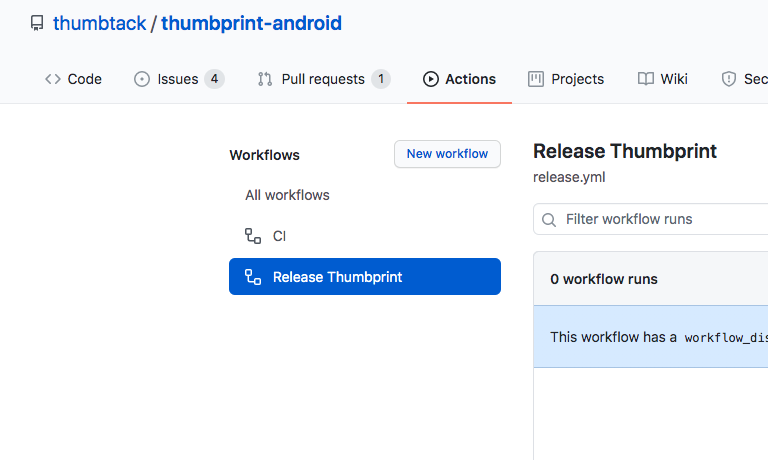
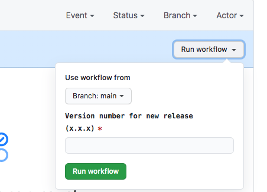

# Contributing to Thumbprint

The Design Systems team welcomes contributions from all developers at Thumbtack. These contributions can range from small bug reports to brand new components and initiatives.

Here are a few ways to get started:

## File a bug or request a feature

Providing feedback is the easiest way to contribute to Thumbprint. You can do this by [creating an issue on GitHub](https://github.com/thumbtack/thumbprint-android/issues).

If you're a Thumbtack employee, you can also post on [#design-systems](https://thumbtack.slack.com/messages/C7FLM0ZGU/details/) for quick help.

## Contribute code to Thumbprint

There are two ways to contribute code back to Thumbprint:

1. **Tackle open GitHub issues:** Issues labeled as “[good first issue](https://github.com/thumbtack/thumbprint-android/issues?q=is%3Aopen+is%3Aissue+label%3A%22good+first+issue%22)” or “[help wanted](https://github.com/thumbtack/thumbprint-android/issues?q=is%3Aopen+is%3Aissue+label%3A%22help+wanted%22)” are perfect for contributors that want to tackle small tasks.
2. **Propose and create a new component:** Creating a component allows contributors to dive-deep into component API design, testing, accessibility, and documentation. Please [create a GitHub issue](https://github.com/thumbtack/thumbprint-android/issues) to propose a new component. If the component is a good candidate for Thumbprint, we’ll schedule a kick-off meeting to discuss next steps.

### Submitting a pull request

You can create a pull request using the standard `gh pr create` command. Here are a few things to keep in mind when creating a pull request:

- **Tests:** Our suite of tests will run automatically on the creation of a pr but you can also run them on your local branch by running `./gradlew check`.

- **Creating a local maven .AAR:** If you want to test your changes locally before creating a PR, you can publish your .AAR locally by running `./gradlew publishReleasePublicationToMavenLocal`. Make sure to add the maven local repo to the application that is importing thumbprint so it is fetched from there and not JitPack. If you are a Thumbtack employee add it to BaseModulePlugin like this:
```
BaseModulePlugin.apply(...) {
   project.repositories{
      // Add here
      mavenLocal {
         content {
            includeGroup("com.github.thumbtack")
         }
      }
   }
}
```

If you're having issues, try changing the version number to one that isn't currently used by JitPack and importing that version locally.

## Releasing a new version of Thumbprint

This will be done by a member of the Thumbtack Android team when code has been merged and is ready for release.

1. **Go to release workflow:** In GitHub, go to the repo's Actions tab and select the [Release Thumbprint](https://github.com/thumbtack/thumbprint-android/actions/workflows/release.yml) workflow.
   
2. **Open dialog:** On the righthand side of the blue banner labeled "This workflow has a workflow_dispatch event trigger.", click "Run workflow."
   
3. **Update version:** Enter a version number for the release (e.g. `1.2.3`). We follow [semantic versioning](https://semver.org/), so look at the changes that will be included in this release and increment it accordingly. Leave "Branch" as `main`.
4. **Start action:** Click "Run workflow" to start the release process.
5. **Manual step:** The script will create a PR that bumps the version in the thumbprint/build.gradle.kts file. _This PR must be merged manually,_ as GitHub Actions do not have write access for the `main` branch.
6. **Manual step:** Update the description of the [GitHub release](https://github.com/thumbtack/thumbprint-android/releases) created by the action with the changes included in this version.

This action
(a) creates the version bump PR mentioned above
(b) creates a tag for the release
(c) creates a release in GitHub tied to this tag

### Manual process (if GitHub Action is broken)

1. **Update version:** Update `version` in `thumbprint/build.gradle.kts`. We follow [semantic versioning](https://semver.org/), so look at the changes that will be included in this release and increment it accordingly.
2. **Commit:** Commit the change you made in step 1 with the subject "Release <version>" (e.g., "Release 1.2.3"). Create and merge a pull request with this commit.
3. **Checkout main:** Return to the `main` branch and pull to get the commit you just merged.
4. **Tag release:** Run `git tag '<version>'` (e.g., `git tag '1.2.3'`) to tag this commit, and then run `git push --tags` to push the new tag.
5. **Create a new release in GitHub:** On the [Releases](https://github.com/thumbtack/thumbprint-android/releases) page for the repo, click "Draft a new release". Set "Tag version" to the name of the tag you created in step 3 (e.g., `1.2.3`). Set "Release title" to the same value as the tag version. In the description field, give an overview of the changes going into this release. When all fields have been filled out, click "Publish release."

---

As always, reach out to [#design-systems](https://thumbtack.slack.com/messages/C7FLM0ZGU/details/) (internal to Thumbtack employees) or [create an issue](https://github.com/thumbtack/thumbprint-android/issues) if you have questions or feedback.